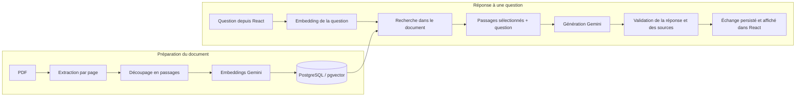

# Document Intelligence Assistant

Une application locale pour importer des PDF, les interroger en langage naturel
et consulter les passages utilisés dans les réponses.

Construite avec **Python / FastAPI, React / TypeScript, PostgreSQL / pgvector et
Gemini**, dans le cadre d’un projet de formation à l’IA appliquée. Le MVP couvre
le parcours complet, de l’import du document à la réponse sourcée.

[Démo pas à pas](docs/demo/README.md) · [API](docs/api.md) · [Développement](docs/development.md) · [Guides techniques](docs/README.md)

## Fonctionnalités

- Import de PDF contenant du texte, avec stockage persistant des fichiers.
- Extraction par page, découpage en passages et indexation vectorielle.
- Recherche sémantique limitée au document sélectionné.
- Réponses générées à partir des passages retrouvés, avec sources consultables.
- Historique des conversations, affichage des pages et surlignage des citations.
- Gestion des erreurs et reprise limitée des indisponibilités de génération Gemini.

Une conversation porte sur **un seul document**. Les questions sont indépendantes :
l’historique est enregistré, mais n’est pas transmis au modèle.

## Démarrage rapide

**Prérequis :** Docker avec Compose v2 récent, moteur Docker démarré, `make` et une
clé API Gemini pour l’indexation et les réponses. Aucun Python, Node.js ou LLM à
installer sur la machine hôte.

```sh
git clone https://github.com/Milkshek/python-fast-api-ia-rag.git
cd python-fast-api-ia-rag
make init
```

Renseigner `GEMINI_API_KEY` dans le fichier `.env` créé, puis démarrer :

```sh
make up
```

Cette commande construit les images, attend les services et applique les migrations.
Elle conserve les réglages et données existants.

| Service | Adresse par défaut |
| --- | --- |
| Application React | [localhost:5173](http://localhost:5173) |
| Documentation interactive de l’API | [localhost:8000/docs](http://localhost:8000/docs) |
| PostgreSQL | `localhost:5432` |

Dans l’interface : **importer → extraire → découper → indexer → créer une conversation
→ poser une question**. Le [guide de démonstration](docs/demo/README.md) fournit un
PDF synthétique reproductible et deux questions pour essayer le parcours.

La clé reste côté backend et `.env` est ignoré par Git. L’indexation transmet le
texte des passages à Google ; les questions et le contexte sélectionné sont également
transmis pour générer les réponses. L’offre et les quotas dépendent du compte Gemini ;
l’application ne vérifie pas sa facturation et n’utilise aucun fallback payant.

## Architecture



Le backend suit la séparation **router / service / repository** : HTTP au router,
cas d’usage et transactions au service, requêtes SQLAlchemy au repository.
Les appels Gemini ont lieu hors transaction SQL ; l’échange est enregistré
atomiquement après validation. Les PDF sont conservés dans un volume distinct.

```text
backend/
  app/          API, documents, conversations, clients IA et base de données
  migrations/   Migrations Alembic
  tests/        Tests pytest
  evaluation/   Corpus et évaluation réelle du RAG
frontend/
  src/          Interface React et tests de composants
Docker, Compose et Makefile à la racine ; image PostgreSQL dans docker/
docs/           Démonstration, référence et guides d’apprentissage
```

## Tests et qualité

```sh
make quality        # Ruff, mypy, pytest, ESLint, TypeScript, build et tests React
make smoke-install  # Installation isolée sur une base vide, puis nettoyage
make evaluate       # Évaluation RAG avec Gemini réel : consomme du quota
```

Les tests backend utilisent PostgreSQL/pgvector réel et simulent Gemini. Les tests
React utilisent Vitest et Testing Library avec appels HTTP simulés. **Il n’y a pas
de suite E2E automatisée dans un navigateur.**

`make quality` et `make smoke-install` ne nécessitent pas de clé Gemini.
Ne pas lancer plusieurs instances d’une même commande de test en parallèle :
elles partagent le nom de leur projet Docker isolé.

`make evaluate` nécessite une application déjà démarrée avec `make up`.
L’évaluation réelle utilise dix questions sur des PDF synthétiques et produit un
rapport local. Le [bilan du corpus](docs/evaluation/2026-09-21-rag-baseline.md)
distingue les contrôles automatiques de la relecture humaine. Une citation valide
ne garantit pas une interprétation correcte du texte.

## Commandes courantes

| Commande | Usage |
| --- | --- |
| `make up` | Construire, démarrer et appliquer les migrations |
| `make down` | Arrêter en conservant les données |
| `make health` | Vérifier l’API locale et PostgreSQL, pas Gemini |
| `make logs SERVICE=api` | Suivre les logs du backend |
| `make format` / `make frontend-format` | Formater Python / React |
| `make test` / `make frontend-check` | Vérifier séparément backend / frontend |
| `make help` | Afficher toutes les commandes |

Après modification de `.env`, des dépendances ou de la configuration, relancer
`make up`. `make restart` ne reconstruit pas les images et ne recharge pas les
variables de configuration. **`docker compose down --volumes` supprime la base et
les fichiers.** Voir [configuration et persistance](docs/development.md).

## Périmètre et limites

- Application de développement locale, sans authentification ni déploiement production.
- PDF avec texte extractible uniquement : pas d’OCR. Taille maximale : 10 Mio.
- Traitement synchrone ; extraction limitée à 200 pages et indexation à 100 chunks.
- Découpage par caractères et contexte borné : certains passages utiles peuvent être omis.
- Pas de comparaison multi-document, de mémoire conversationnelle, de tool calling ou d’agent.
- Pas de clé d’idempotence : après une coupure réseau, relire l’historique avant de renvoyer.
- Disponibilité et quotas Gemini externes ; les reprises ne garantissent pas un succès.

## À propos

Projet développé avec l’aide de l’IA, en privilégiant la compréhension du code,
la séparation des responsabilités et des tests sur les comportements critiques.
Le [programme de formation](document-intelligence-training.md) et les
[guides de lecture](docs/README.md) détaillent les choix et leurs limites.
Les retours sur l’architecture, les tests et les pratiques Python sont les bienvenus.
